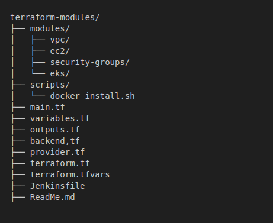

# Terraform AWS Infrastructure Provisioning

This project uses **Terraform** to provision and manage key AWS resources, including **VPCs**, **Subnets**, **Security Groups**, **EC2 Instances**, and a fully functional **EKS (Elastic Kubernetes Service)** cluster. It also supports automatic deployment of **Docker containers** and includes reusable modules to streamline infrastructure management.
---

## 🚀 Features

1. **Provision Key AWS Resources**  
   Create VPCs, public and private subnets, internet gateways, and route tables.

2. **Reusable Terraform Modules**  
   Modular structure for:
   - VPC
   - EC2 Instances
   - Security Groups
   - EKS Cluster

3. **EC2 & Docker Automation**  
   - Deploy EC2 instances with specified configurations.
   - Automatically install and run Docker containers using `user_data` scripts.

4. **Elastic Kubernetes Service (EKS)**  
   - Create and configure an EKS cluster.
   - Manage node groups with auto-scaling.
   - Pass required subnets, VPCs, IAM roles, and tags.

5. **Remote State Management**  
   - Store Terraform state files in an AWS S3 bucket.
   - Configure state locking using S3 to prevent concurrent modifications.

6. **CI/CD Integration**  
   - Automate provisioning and deployment with a Jenkinsfile CI/CD pipeline.


## 📁 Project Structure



---

## ✅ Pre-Requisites

Before using this project, ensure the following are installed and configured:

- ✅ [AWS CLI](https://docs.aws.amazon.com/cli/latest/userguide/getting-started-install.html)
    ```bash
    aws configure
    ```
- ✅ [Terraform](https://developer.hashicorp.com/terraform/downloads) (>= 1.0)

---

## 📥 Clone the Repository

```bash
git clone https://github.com/BINAH25/terraform.git
cd terraform
```

## Initialize the project

```bash
terraform init
```
## Validate the configuration

```bash
terraform validate

```
## Preview the changes

```bash
terraform plan

```
## Apply the configuration

```bash
terraform apply

```
